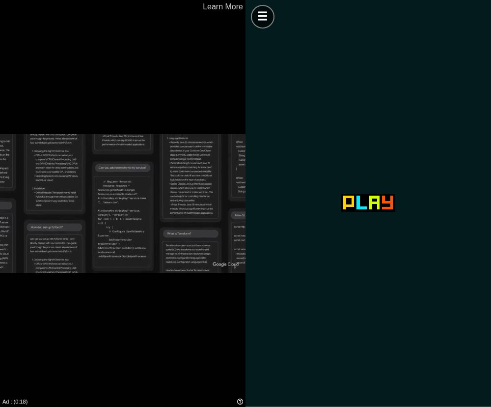
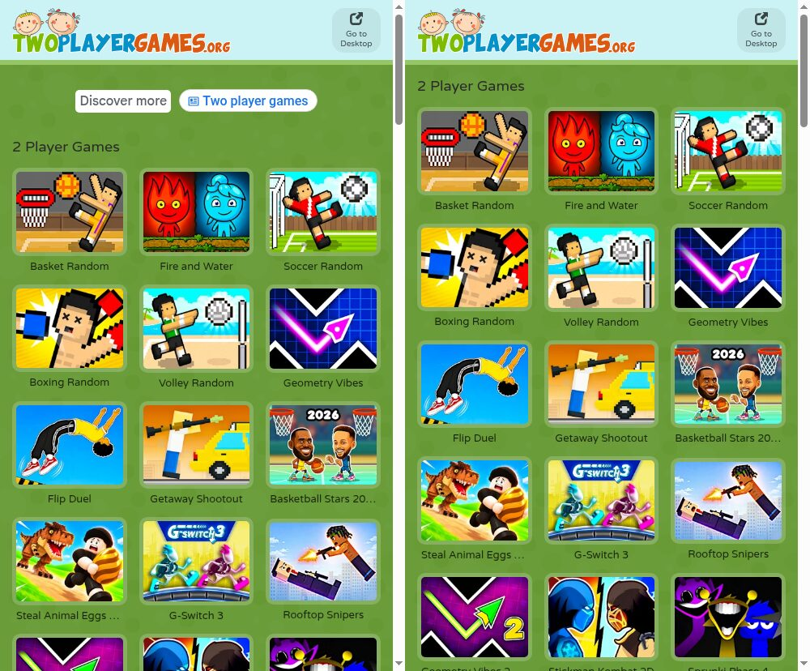

[TwoPlayerGames](https://m.twoplayergames.org/) 上有不少好玩的双人游戏，但广告出现在三个地方：游戏列表上方的横幅，点击 **Play** 后的视频广告（我测试时那一条超过 30 秒），以及很多游戏内部的插播广告。**TwoPlayerGames Ad Remover** 是一个很小的 Chrome 扩展，把这三处广告都去掉了。它只在 twoplayergames.org 上生效，不影响其他网站。

**[下载 TwoPlayerGames Ad Remover 1.0.0（.zip，9 KB）](twoplayergames-ad-remover-1.0.0.zip)**

SHA-256：`fe797edb53efc07d374668e4dedeaffd4059c593dff876376eb3c0b2ae428e3c`

## 安装

这个扩展没有上架 Chrome 网上应用店，需要以“未打包的扩展程序”方式加载：

1. 下载上面的 zip 并解压，得到一个名为 `twoplayergames-ad-remover` 的文件夹。
2. 在 Chrome 中打开 `chrome://extensions`。
3. 打开右上角的**开发者模式**。
4. 点击**加载已解压的扩展程序**，选择 `twoplayergames-ad-remover` 文件夹（里面有 `manifest.json` 的那一层）。
5. 打开 [m.twoplayergames.org](https://m.twoplayergames.org/)，已经打开的话刷新一下。

需要 Chrome 111 或更新版本，Edge、Brave 等基于 Chromium 的浏览器也可以使用。安卓版 Chrome 不支持扩展，在手机上需要换一个能加载 Chrome 扩展的浏览器。安装后不要删除这个文件夹：Chrome 每次启动都会从这里加载扩展。

## 去掉了什么

| 位置 | 网站的做法 | 扩展的处理 |
|---|---|---|
| 首页和分类页 | AdSense 横幅，以及一个推荐搜索词的广告单元 | 拦截请求，并隐藏空出来的广告位，游戏列表随之上移 |
| 每局游戏开始前 | 点击 **Play** 后播放 Google IMA 视频广告 | 拦截视频广告 SDK，网站随即直接进入游戏 |
| 游戏内部 | 通过 Google H5 Games Ads 接口（`adBreak()`）插播广告 | 拦截广告脚本，并告诉游戏“当前没有广告” |

## 原理

扩展除图标外只有四个文件，只申请了一项权限 `declarativeNetRequest`。它的脚本只在 m.twoplayergames.org 和 files.twoplayergames.org 上运行，所以 Chrome 会提示它能读取和更改这两个网站上的数据。它不会向任何地方发送数据。

**`rules.json`：拦截广告服务器。** 一条声明式网络规则拦截发往 Google 广告域名的请求（`googlesyndication.com`、`doubleclick.net`、`imasdk.googleapis.com` 等）。规则带有条件 `initiatorDomains: ["twoplayergames.org"]`，所以只对 twoplayergames.org 及其子域名下的页面和游戏框架发出的请求生效，其他网站的广告不受影响。规则由 Chrome 直接执行，所以扩展不需要后台脚本。

**`hide.css`：收起空广告位。** 广告脚本被拦截后，横幅的容器仍会在页面顶部占一块位置。这份样式表隐藏了 `.main-ads`、`ins.adsbygoogle` 和视频广告的遮罩层 `#ima-container`。

**开局前的视频广告不需要额外处理。** 动手之前我先读了网站自己的脚本。它找不到 Google IMA（`google.ima`）时，会在控制台输出“No Google IMA, maybe an ad-blocker? 🤔”，隐藏广告容器，并启用 **Play** 按钮。点击 **Play** 后，启动广告失败，直接进入游戏。所以只要拦截 `ima3.js` 就够了。

**`ad-shim.js`：让游戏不再等广告。** 放在 `files.twoplayergames.org` 上的游戏使用 Google 的 H5 Games Ads 接口，会调用 `adConfig()` 和 `adBreak()`，其中一些要等到 `onReady` 或 `adBreakDone` 回调之后才开始或继续。如果只是拦截广告脚本，这些回调永远不会执行。这个替代脚本在页面自己的 JavaScript 环境中（`"world": "MAIN"`）先于所有页面脚本运行，提供一个替代的 `window.adsbygoogle` 对象：

- `adConfig({ onReady })` 会立即调用 `onReady`。
- `adBreak({ type, adBreakDone })` 从不调用 `beforeAd`，只以 `noAdPreloaded` 状态调用 `adBreakDone`。真正的 SDK 在没有准备好广告时报告的也是这个状态。
- 激励广告（`type: "reward"`）报告 `notReady`。你拿不到奖励，但游戏会照常运行。

页面里写的是 `adsbygoogle = window.adsbygoogle || []`，也可能有页面直接赋值一个新数组。为此，`window.adsbygoogle` 用 getter 和 setter 定义：赋值数组不会替换掉替代对象，数组里已经排队的请求也会被处理。

## 测试

我把扩展加载进无头 Chromium，用手机的 User-Agent 依次打开首页、《Basket Random》和《Flip Duel》，装和不装扩展各测一遍：

- **不装扩展：** 首页加载了来自 `pagead2.googlesyndication.com`、`googleads.g.doubleclick.net` 等域名的脚本，并显示一个 60 像素高的广告单元。在《Basket Random》中点击 **Play** 15 秒后，屏幕上仍是视频广告，还剩 18 秒。
- **装上扩展：** 所有发往广告域名的请求都以 `net::ERR_BLOCKED_BY_CLIENT` 失败。在游戏页面上，网站自己的日志依次输出“No Google IMA”→“Show the content 👾”，游戏的开始界面随即出现。Unity 游戏《Flip Duel》的日志中出现了来自替代脚本的“AdConfig Ready”，游戏正常加载。

## 局限

- 有些游戏（例如《Fire and Water》和《Basketball Stars》）嵌入自 GameDistribution（`html5.gamedistribution.com`）。在这些页面上，扩展仍会跳过网站的视频广告，但 GameDistribution 框架里有它自己的广告系统，扩展没有处理。GameDistribution 的游戏也运行在许多其他网站上，拦截它的广告可能让其中一些游戏卡住。
- 扩展依赖网站当前的页面结构和广告设置。如果 TwoPlayerGames 改变了广告的展示方式，可能需要更新 `hide.css` 里的选择器或 `rules.json` 里的域名列表。
- 样式表和替代脚本只在 `m.twoplayergames.org` 和 `files.twoplayergames.org` 上的游戏框架中运行。我没有测试桌面版网站 `www.twoplayergames.org`。
